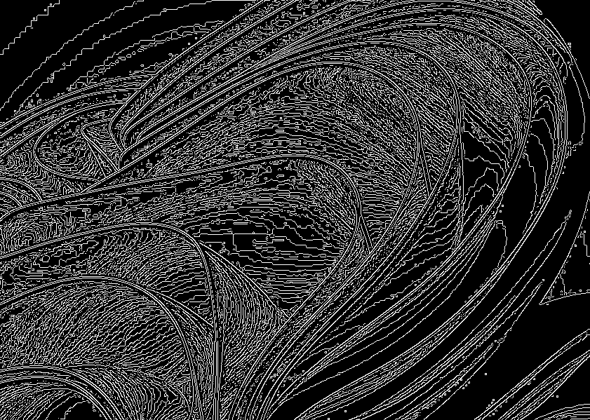

# convert-image-to-binary


画像をバイナリーに変換してファイルに出力

## Demo

### 入力ファイル



## 出力ファイルの一部

- 最初に入力画像のピクセル数が縦 横の順番で与えられます

```plaintext
599 841
0000000000000000000000000000000000000000000000000000000000000000000000000000000000001000000000000000000000000000000000000000000000000000000000000000000000000000000000000000000000000000000000000000000000001000000000000000000000000000000000000000000000000000000000000000000000000000000000000000000000000011111111111111111111111111111111111111111111111111111111111111100100000110011111111000000111000000011111001100010001100111110001000000000001111000101010000000100110000000000000000000010001000001111001111100011111101111101111111000100001100000011000000000000000001000000010000000000001111110000000000000000000000000000000000000000000000000000000011111110000000000000010011111100000010100000000001000000111100110001001000001110000010000001000000100100001100000000000000000000000000000000000000000000000000000000000000000000000000000000000000
0000000000000000000000000000000000000000000000000000000000000000000000000000000000001000000000000000000000000000000000000000000000000000000000000000000000000000000000000000000000000000000000000000111111111000000000000000000000000000000000000000000000000000000000000000000000000000000000000000000000000100000000000000000000000000000000000000000000000000000000000000001000011100110000000000000101000000000000000010000111001100000111001000000000000011011110000000010000000000000001000000000000000110000111010111110000000010000000000011001001000011100000000000011111100011000000000011111110000000000111111111111111111111111111111111111111111111111000000000001111111000000000000000100000001111100011111111000000100001101111111000011100011111001110001110010000110001110000000000000000000000000000000000000000000000000000000000000000000000000000000
```

## Installation

```bash
git clone https://github.com/kkml4220/convert-image-to-binary.git
cd convert-image-to-binary
pip install -r requirements.txt
```

## Usage

```bash
python convert_image_to_binary.py input/sample_background.png
```

- 作成者 : 高橋 克征 (Takahashi Katsuyuki)
- E-mail : [Takahashi.Katsuyuki.github@gmail.com](Takahashi.Katsuyuki.github@gmail.com)

## License

"convert-image-to-binary" is under [MIT license](https://en.wikipedia.org/wiki/MIT_License).
